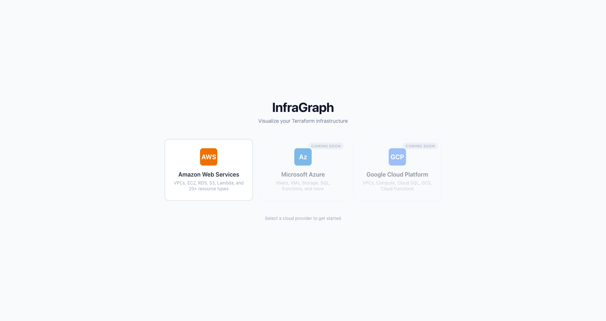
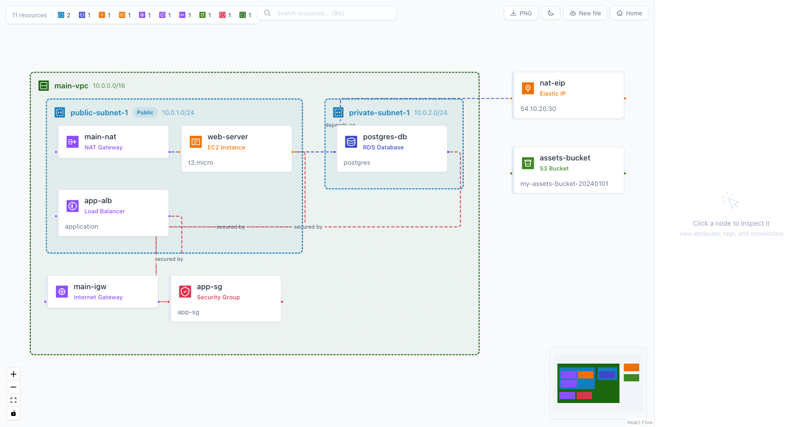

# InfraGraph

[](https://github.com/manimovassagh/infragraph/actions/workflows/aws-architect-ci.yml)
[](https://github.com/manimovassagh/infragraph/releases)
[](LICENSE)
[](https://www.typescriptlang.org/)
[](https://react.dev/)
[](https://nodejs.org/)
[](docker-compose.yml)
[](https://github.com/manimovassagh/infragraph/pulls)

Visualize your Infrastructure-as-Code as interactive architecture diagrams. Upload Terraform state files, HCL source, CloudFormation templates, or CDK-synthesized output — InfraGraph auto-detects your cloud provider and IaC tool, then renders a live, zoomable canvas with VPCs, subnets, and resources.






## Features

- **Multi-IaC** — Supports Terraform (`.tfstate`, `.tf`), AWS CloudFormation (JSON/YAML), and AWS CDK (synthesized templates)
- **Multi-cloud** — AWS (20+), Azure (12+), and GCP (11+) resource types with branded icons
- **GitHub Integration** — Connect your GitHub account, browse repos (including private), scan for IaC projects, and visualize directly
- **REST API** — Full programmatic access for CI/CD pipelines, scripts, and custom integrations
- **Session History** — Save and revisit past diagrams (requires Supabase auth)
- Smart file detection — auto-detects IaC tool and cloud provider from file content
- Auto-layout: VPC > Subnet > Resource hierarchy with nested containers
- Interactive React Flow canvas with zoom, pan, minimap, and dark mode
- Click any node to inspect attributes, tags, and connections
- Provider badge showing cloud provider, filename, and resource count
- Export diagrams as PNG
- Search resources with `Cmd+K`
- Resource type filter badges with counts
- Built-in documentation with searchable guides and dedicated API reference
- Client-side routing with browser back/forward support
- Sample infrastructure for quick demo (one click per provider)
- Auto-detection of cloud provider from resource types
- Google OAuth sign-in with Supabase (optional — works in guest mode without it)
- Fully Dockerized with multi-stage builds

## Project Structure

```
infragraph/
├── apps/
│   ├── backend/           # Express API — parses tfstate/HCL/CloudFormation, GitHub integration
│   │   ├── src/
│   │   │   ├── parser/    # tfstate, HCL, CloudFormation, and graph parsers
│   │   │   ├── providers/ # Cloud provider configs (aws, azure, gcp)
│   │   │   ├── services/  # GitHub service (OAuth, repos, scan, fetch)
│   │   │   ├── routes/    # API route handlers (parse, github, sessions, user)
│   │   │   └── middleware/ # Auth middleware (optionalAuth, requireAuth)
│   │   └── Dockerfile
│   └── frontend/          # Vite + React 18 — React Flow canvas + UI
│       ├── src/
│       │   ├── components/  # Canvas, nodes, panels, modals, docs
│       │   ├── providers/   # Frontend provider configs (aws, azure, gcp)
│       │   └── lib/         # API client, auth, GitHub utilities
│       └── Dockerfile
├── packages/
│   └── shared/            # Shared TypeScript types
├── e2e/                   # Playwright end-to-end tests
├── test/
│   ├── fixtures/
│   │   ├── projects/         # 11 .tf source test projects
│   │   ├── tfstate/          # 11 .tfstate test fixtures
│   │   └── cloudformation/   # 5 CloudFormation/CDK test templates
│   └── screenshots/
├── docker-compose.yml
└── Makefile
```

## Quick Start

```bash
# With Docker (recommended)
make up

# Without Docker
make install dev
```

Open http://localhost:3000 and upload a `.tfstate`, `.tf`, or CloudFormation template (`.yaml`, `.json`) — or click **Connect GitHub Repo** to browse your repositories.

## Prerequisites

- **Docker** (recommended) — no other dependencies needed
- **Without Docker**: Node.js 20+, npm 10+

## Environment Variables

### Backend (`apps/backend/.env`)

| Variable | Required | Description |
|----------|----------|-------------|
| `PORT` | No | Server port (default: 3001) |
| `FRONTEND_URL` | No | Frontend URL for CORS (default: http://localhost:3000) |
| `SUPABASE_URL` | No | Supabase project URL (enables auth & sessions) |
| `SUPABASE_SERVICE_ROLE_KEY` | No | Supabase service role key |
| `GITHUB_CLIENT_ID` | No | GitHub OAuth App client ID (enables GitHub connect) |
| `GITHUB_CLIENT_SECRET` | No | GitHub OAuth App client secret |

### Frontend (`apps/frontend/.env`)

| Variable | Required | Description |
|----------|----------|-------------|
| `VITE_SUPABASE_URL` | No | Supabase project URL |
| `VITE_SUPABASE_ANON_KEY` | No | Supabase anon key |
| `VITE_GITHUB_CLIENT_ID` | No | GitHub OAuth App client ID |
| `VITE_API_URL` | No | Backend API URL override |

All features degrade gracefully — the app works in guest mode without any env vars.

### GitHub OAuth Setup

To enable the "Connect to GitHub" feature:

1. Create a GitHub OAuth App at https://github.com/settings/developers
2. Set the callback URL to `http://localhost:3000/auth/github-callback`
3. Add `GITHUB_CLIENT_ID` and `GITHUB_CLIENT_SECRET` to backend `.env`
4. Add `VITE_GITHUB_CLIENT_ID` to frontend `.env`

## Development

```bash
make install       # Install all dependencies
make dev           # Run backend (3001) + frontend (3000) concurrently
make dev-backend   # Run backend only
make dev-frontend  # Run frontend only
```

## Docker

```bash
make up            # Build and start all services
make down          # Stop and remove containers
make restart       # Full restart (down + clean + build + up)
make logs          # Tail container logs
make ps            # Show container status
```

## Testing

```bash
make test          # Run all tests (unit + smoke)
make test-unit     # Vitest unit tests with coverage
make test-e2e      # Playwright end-to-end tests
make lint          # ESLint across all workspaces
make typecheck     # TypeScript type checking
make check         # Run lint + typecheck + test (CI equivalent)
```

## API

Interactive Swagger docs available at http://localhost:3001/docs when the backend is running.

### Parse Endpoints

| Method | Endpoint | Description |
|--------|----------|-------------|
| `POST` | `/api/parse` | Upload a `.tfstate` file (multipart form, field: `tfstate`) |
| `POST` | `/api/parse/raw` | Send raw tfstate JSON: `{ "tfstate": "..." }` |
| `POST` | `/api/parse/hcl` | Upload `.tf` files (multipart form, field: `files`) |
| `POST` | `/api/parse/cfn` | Upload a CloudFormation template (multipart form, field: `template`) |
| `POST` | `/api/parse/cfn/raw` | Send raw CFN template: `{ "template": "..." }` |

### GitHub Endpoints

| Method | Endpoint | Description |
|--------|----------|-------------|
| `POST` | `/api/github/token` | Exchange OAuth code for access token |
| `GET` | `/api/github/repos` | List authenticated user's repos (requires `X-GitHub-Token` header) |
| `POST` | `/api/github/scan` | Scan a repo for Terraform projects |
| `POST` | `/api/github/parse` | Parse a Terraform project from a GitHub repo |

### System

| Method | Endpoint | Description |
|--------|----------|-------------|
| `GET` | `/health` | Health check |

All parse endpoints return:

```ts
{
  nodes: GraphNode[];
  edges: GraphEdge[];
  resources: CloudResource[];
  provider: CloudProvider;
  warnings: string[];
  iacSource?: IacSource; // "terraform-state" | "terraform-hcl" | "cloudformation" | "cdk"
}
```

GitHub endpoints accept an optional `X-GitHub-Token` header for private repo access and higher rate limits (5,000 req/hr vs 60 req/hr).

## Supported IaC Tools

| Tool | Formats | Status |
|------|---------|--------|
| **Terraform** | `.tfstate` (state files), `.tf` (HCL source) | Supported |
| **AWS CloudFormation** | `.json`, `.yaml`, `.yml`, `.template` | Supported |
| **AWS CDK** | Synthesized CloudFormation templates (`cdk synth` output) | Supported |

CloudFormation and CDK templates are automatically detected from file content — no manual selection needed.

## Supported Cloud Providers

| Provider | Status | Resource Types |
|----------|--------|----------------|
| **AWS** | Supported | VPC, Subnet, EC2, RDS, S3, Lambda, ECS, EKS, ALB, and 20+ more |
| **Azure** | Supported | VNet, Subnet, VM, Storage, SQL, Functions, NSG, Public IP, LB, AKS, and more |
| **GCP** | Supported | VPC, Subnet, Compute, Cloud SQL, GCS, Functions, Firewall, LB, GKE, and more |

## GitHub Integration

InfraGraph connects directly to GitHub so you can visualize Terraform projects without downloading files.

### How It Works

1. Click **Connect GitHub Repo** on the home page
2. Authorize via GitHub OAuth (popup — you stay on the page)
3. Browse your repositories (including private repos)
4. Select a repo → InfraGraph scans for Terraform projects
5. Pick a project → instant architecture diagram

### Public Repos (No Auth)

You can also paste any public GitHub repo URL without connecting:

```
https://github.com/hashicorp/terraform-provider-aws
```

### Security

- GitHub tokens are stored in your browser only — never on the server
- OAuth scope is limited to `repo` (read access)
- No code is cloned or stored — files are fetched on demand and processed in memory
- Click **Disconnect** at any time to revoke access

## API Usage

InfraGraph's REST API lets you integrate infrastructure visualization into your workflows — CI/CD pipelines, internal dashboards, or custom tools.

### Scan a GitHub Repo

```bash
curl -X POST http://localhost:3001/api/github/scan \
  -H "Content-Type: application/json" \
  -H "X-GitHub-Token: ghp_your_token" \
  -d '{"repoUrl": "https://github.com/your-org/infrastructure"}'
```

Returns a list of directories containing `.tf` files:

```json
{
  "owner": "your-org",
  "repo": "infrastructure",
  "defaultBranch": "main",
  "projects": [
    { "path": "environments/production", "files": ["main.tf", "variables.tf"] },
    { "path": "modules/networking", "files": ["vpc.tf", "subnets.tf"] }
  ]
}
```

### Parse a Terraform Project

```bash
curl -X POST http://localhost:3001/api/github/parse \
  -H "Content-Type: application/json" \
  -H "X-GitHub-Token: ghp_your_token" \
  -d '{"repoUrl": "https://github.com/your-org/infrastructure", "projectPath": "environments/production"}'
```

### Upload a State File

```bash
curl -X POST http://localhost:3001/api/parse \
  -F "tfstate=@terraform.tfstate"
```

### Send Raw JSON

```bash
curl -X POST http://localhost:3001/api/parse/raw \
  -H "Content-Type: application/json" \
  -d '{"tfstate": "<your-state-json>"}'
```

### Upload a CloudFormation Template

```bash
curl -X POST http://localhost:3001/api/parse/cfn \
  -F "template=@my-stack.yaml"
```

For CDK-synthesized templates, add `?source=cdk` to tag the source:

```bash
curl -X POST http://localhost:3001/api/parse/cfn?source=cdk \
  -F "template=@cdk.out/MyStack.template.json"
```

All parse responses return graph data (nodes, edges, resources, provider) that can be rendered with React Flow or any graph library.

> **Tip:** The `X-GitHub-Token` header is optional for public repos. Adding it increases the GitHub API rate limit from 60 to 5,000 requests per hour.

## License

Apache-2.0 with Commons Clause
